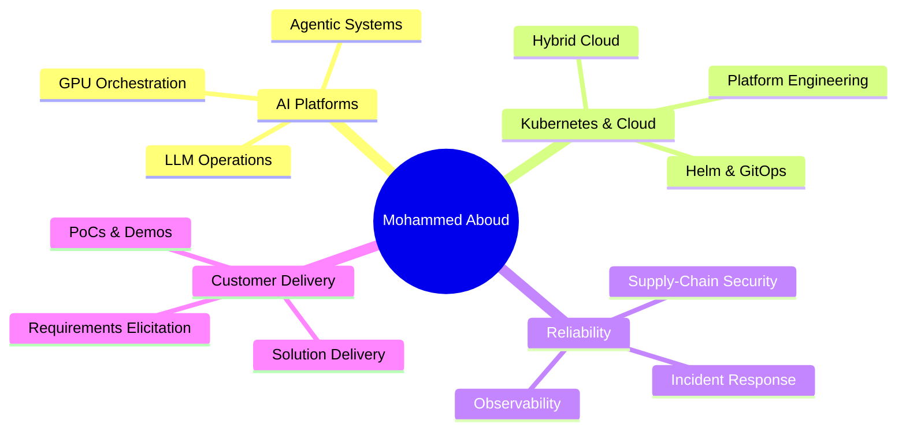

<h1 align="center">
  <a href="https://github.com/m-aboud">

  </a>
</h1>

<p align="center">
  <a href="https://www.linkedin.com/in/mohammed-a-a209001aa"></a>
  <a href="mailto:mohd.aboud@outlook.com"></a>
  
  
</p>

<p align="center">
  
</p>

---

## 👋 About

I deploy and operate **AI platforms — LLM and agentic systems — inside enterprise environments**, then stay embedded to make them work in production across Saudi Arabia and MENA.

My work bridges **hands-on delivery**, **customer-facing engineering**, and **operational reliability** — from shipping Helm-packaged workloads on Kubernetes and GitOps pipelines to observability, security, and day-2 support in private and hybrid cloud.

**The OpenClaw platform** is my hub of runnable labs and reference implementations — agentic AI, GitOps delivery, GPU orchestration, and observability — each built to be deployed, not just diagrammed.

```yaml
role:        Forward Deployed Engineer / AI Platform Engineer
focus:       LLM & Agentic Systems • Kubernetes • Hybrid Cloud • GitOps
mindset:     Customer-embedded • Ship-and-support • SLO-driven
currently:   Deploying AI platforms in production across private & hybrid cloud
open_to:     Forward Deployed Engineer • AI Platform / DevOps • Solutions Engineering
```

---

## 🎯 Focus Areas

<table>
  <tr>
    <td valign="top" width="50%">

**🚀 AI Platform Delivery**
- LLM & agentic application platforms (production)
- Multi-model orchestration (Claude, OpenAI, Gemini, Ollama)
- MCP tool servers & agent frameworks
- ML/GPU pipeline observability

**☸️ Kubernetes & Cloud**
- Production K8s (EKS, GKE, OpenShift) + Helm
- GitOps delivery (Argo CD, Rollouts, Kyverno)
- Infrastructure as Code (Terraform, Ansible)
- Hybrid & multi-cloud (AWS, Azure, GCP, on-prem)

</td>
    <td valign="top" width="50%">

**📊 Reliability & Security**
- SLO-driven observability (Prometheus, Grafana, Loki)
- Supply-chain security (Cosign, SLSA, Trivy)
- Incident response & structured RCA
- IAM / RBAC, secrets, compliance & audit readiness

**🤝 Customer-Facing Engineering**
- Requirements elicitation & technical discovery
- Data modeling & schema design
- PoCs, demos, and solution delivery
- Enterprise stakeholder enablement

</td>
  </tr>
</table>

---

## 🚀 Featured Projects

| Project | Description | Stack |
|---|---|---|
| 🚀 [**GitOps CI/CD Platform**](https://github.com/m-aboud/gitops-cicd-platform) | Full Terraform → EKS → Helm → Argo CD → Rollouts → Kyverno reference platform with signed images & SLSA provenance | `Terraform` `Helm` `Argo CD` `K8s` `Cosign` `Trivy` `Kyverno` |
| ⚡ [**GPU Workload Orchestration on Kubernetes**](https://github.com/m-aboud/gpu-k8s-orchestration) | Schedule, isolate, and observe GPU workloads on K8s — GPU Operator, namespace quotas, time-slicing, DCGM/Grafana telemetry, with a Helm chart and CUDA/PyTorch/Triton examples | `Kubernetes` `Helm` `GPU Operator` `Triton` `DCGM` `Python` |
| 🟩 [**OpenClaw MCP Agentic Lab**](https://github.com/m-aboud/openclaw-mcp-agentic-lab) | OpenClaw gateway · MCP tool server · Claude + OSS models | `Python` `FastAPI` `MCP` `Claude API` `Ollama` `Typer` `Docker` |
| 🤖 [**Agentic Frameworks Lab**](https://github.com/m-aboud/agentic-frameworks-lab) | Three runnable agents (LangGraph, CrewAI, AutoGen) demonstrating tool use, multi-step reasoning, state handoff, and output guardrails, with offline mock fallbacks | `LangGraph` `CrewAI` `AutoGen` `Agentic AI` `Guardrails` `Python` |
| 🛡️ [**Multimodal Incident Copilot**](https://github.com/m-aboud/multimodal-incident-copilot) | AI-powered infrastructure incident triage using vision, OCR, multi-model arbitration, structured reporting, and optional voice briefings | `Python` `OpenAI` `Gemini` `Claude` `OpenCV` `Tesseract` `FastAPI` `Streamlit` `Docker` |
| ☁️ [**GCP Landing Zone Lab**](https://github.com/m-aboud/gcp-landing-zone-lab) | Secure GCP landing zone built with Terraform — private GKE, Cloud SQL, IAM, monitoring, and enterprise migration guidance | `GCP` `Terraform` `GKE` `Cloud SQL` `IAM` `VPC` `DevOps` |
| 📊 [**Observability Platform**](https://github.com/m-aboud/observability-platform) | Full Prometheus + Grafana + Loki + Alertmanager stack with rules | `Docker` `Prometheus` `Grafana` `Loki` |
| ⚙️ [**Infra Automation Lab**](https://github.com/m-aboud/infra-automation-lab) | Production-grade Terraform, Ansible, Docker & Kubernetes patterns | `Terraform` `Ansible` `K8s` `GH Actions` |
| 🟩 [**NVIDIA AI & HPC Portfolio**](https://github.com/m-aboud/nvidia-ai-hpc-portfolio) | CUDA benchmarking, AI/HPC cluster capacity planning & NVIDIA GPU observability tied to real data center concerns | `CUDA C++` `Python` `Docker` `DCGM` `Prometheus` `Grafana` |
| 🌟 [**OpenClaw Enterprise Platform**](https://github.com/m-aboud/openclaw-enterprise-platform) | Master architecture, documentation, and governance repository unifying all OpenClaw projects | `Platform Engineering` `GitOps` `Zero Trust` `SRE` `AI Infra` |
| 🤖 [**AI Job Agent**](https://github.com/m-aboud/ai-job-agent) | LLM-powered job discovery, ranking, CV tailoring & Telegram alerts | `Python` `Playwright` `LLMs` `Docker` `SQLite` |
| 🧠 [**AI Infrastructure Blueprints**](https://github.com/m-aboud/ai-infrastructure-blueprints) | Reference architectures for AI-ready DCs, GPU clusters, K8s scheduling | `Markdown` `Mermaid` `K8s` `GPU` |
| 🏢 [**Data Center Ops Toolkit**](https://github.com/m-aboud/datacenter-ops-toolkit) | Calculators & playbooks for UPS, generators, cooling, capacity & RCA | `Python` `CLI` `Markdown` |
| 📁 [**Portfolio**](https://github.com/m-aboud/portfolio) | Architecture samples, PoC writeups & solution design artefacts | `Markdown` `Diagrams` |

---

## 📈 GitHub Activity

<p align="center">
  
  
</p>

<p align="center">
  
</p>

<p align="center">
  
</p>

---

## 🎓 Certifications

<p>
  
  
  
  
  
</p>

📜 Verify all certifications via my [Credly profile](https://www.credly.com/users/mohammed-aboud.937de765)

---

## 💡 Selected Achievements

- 🚀 Built and shipped a **GitOps delivery platform** (Terraform → EKS → Helm → Argo CD → Rollouts → Kyverno) with Cosign-signed images and SLSA provenance.
- ☸️ Deployed and operated **AI, conversational, and communication platforms** on Kubernetes/OpenShift for **5,000+ enterprise customers** across MENA.
- 🤝 Led **technical discovery, PoCs, and enterprise enablement**, driving adoption of cloud and AI platforms across strategic accounts.
- 📉 Reduced monitoring noise and incident recurrence through **SLO-driven observability** and structured RCA practices.
- 🔄 Delivered **infrastructure automation** and multi-cloud landing zones, cutting new-environment provisioning from weeks to hours.

---

## 🧭 Current Direction



---

## 🤝 Let's Connect

<p>
  <a href="https://www.linkedin.com/in/mohammed-a-a209001aa">
    
  </a>
  <a href="mailto:mohd.aboud@outlook.com">
    
  </a>
  <a href="https://github.com/m-aboud?tab=repositories">
    
  </a>
</p>

<p align="center"><i>I ship AI into production — and stay to make it work. 🚀</i></p>
