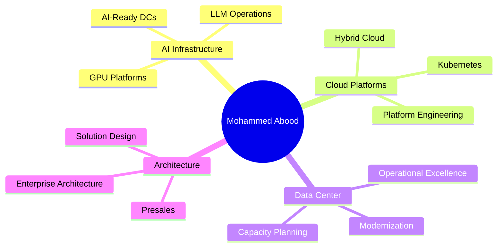

<h1 align="center">
  <a href="https://github.com/mohammedabood">
    
  </a>
</h1>

<p align="center">
  <a href="https://linkedin.com/in/mohammedabood"></a>
  <a href="mailto:mohd.aboud@outlook.com"></a>
  
  
</p>

<p align="center">
  
</p>

---

## 👋 About

I design and deliver **enterprise infrastructure, hybrid cloud platforms, AI automation systems, and data center solutions** across Saudi Arabia and MENA.

My work bridges **infrastructure reliability**, **business transformation**, and **automation** — from data center operations and cloud architecture to AI-enabled platforms, observability, and operational excellence.

```yaml
role:        Senior Infrastructure & Cloud Architect
focus:       AI Infrastructure • Hybrid Cloud • Data Center Modernization
mindset:     Architecture-first • Automation-by-default • SLO-driven
currently:   Building AI-native infrastructure blueprints & automation tooling
open_to:     Senior Architect • Solutions Architect • Presales • Platform Lead
```

---

## 🎯 Focus Areas

<table>
  <tr>
    <td valign="top" width="50%">

**🏗️ Infrastructure & Cloud**
- Hybrid Cloud Architecture (AWS, Azure, on-prem)
- Data Center Engineering (MEP, IT, commissioning)
- Kubernetes & Container Platforms
- Infrastructure as Code (Terraform, Ansible)

**🤖 AI Infrastructure**
- GPU cluster design & scheduling
- AI-ready data center planning
- LLM application platforms
- ML pipeline observability

</td>
    <td valign="top" width="50%">

**📊 Operations & Reliability**
- SLO-driven observability (Prometheus, Grafana, Loki)
- Incident response & structured RCA
- Capacity & power/cooling management
- IT governance, compliance, audit readiness

**💼 Presales & Architecture**
- Solution architecture & design authority
- Technical presales, PoCs, demos
- Enterprise architecture frameworks
- Customer-facing technical leadership

</td>
  </tr>
</table>

---

## 🚀 Featured Projects

| Project | Description | Stack |
|---|---|---|
| 🤖 [**AI Job Agent**](https://github.com/mohammedabood/ai-job-agent) | LLM-powered job discovery, ranking, CV tailoring & Telegram alerts | `Python` `Playwright` `LLMs` `Docker` `SQLite` |
| 🏢 [**Data Center Ops Toolkit**](https://github.com/mohammedabood/datacenter-ops-toolkit) | Calculators & playbooks for UPS, generators, cooling, capacity & RCA | `Python` `CLI` `Markdown` |
| ⚙️ [**Infra Automation Lab**](https://github.com/mohammedabood/infra-automation-lab) | Production-grade Terraform, Ansible, Docker & Kubernetes patterns | `Terraform` `Ansible` `K8s` `GH Actions` |
| 📊 [**Observability Platform**](https://github.com/mohammedabood/observability-platform) | Full Prometheus + Grafana + Loki + Alertmanager stack with rules | `Docker` `Prometheus` `Grafana` `Loki` |
| 🧠 [**AI Infrastructure Blueprints**](https://github.com/mohammedabood/ai-infrastructure-blueprints) | Reference architectures for AI-ready DCs, GPU clusters, K8s scheduling | `Markdown` `Mermaid` `K8s` `GPU` |
| 📁 [**Portfolio**](https://github.com/mohammedabood/portfolio) | Architecture samples, PoC writeups & solution design artefacts | `Markdown` `Diagrams` |

---

## 🛠️ Tech Stack

<p>
  
  
  
  
</p>
<p>
  
  
  
  
  
  
</p>
<p>
  
  
  
  
</p>
<p>
  
  
  
  
</p>

---

## 📈 GitHub Activity

<p align="center">
  
  
</p>

<p align="center">
  
</p>

<p align="center">
  
</p>

---

## 🎓 Certifications

<p>
  
  
  
  
  
  
  
</p>

> 📜 Verify all certifications via my [Credly profile](https://www.credly.com/users/mohammedabood) <!-- update once your Credly URL is live -->

---

## 💡 Selected Achievements

- 🏢 Architected and governed enterprise data center and hybrid cloud environments supporting **200+ production services**.
- ⚡ Led **modular data center delivery** covering MEP, IT, security, commissioning, and operational readiness.
- 🎯 Supported **presales discovery, demos, PoCs, proposals**, and customer-facing solution architecture.
- 📉 Reduced monitoring noise and incident recurrence through **SLO-driven observability** and structured RCA practices.
- 🔄 Delivered **infrastructure automation**, cloud operations, compliance alignment, and service reliability improvements.

---

## 🧭 Current Direction



---

## 🤝 Let's Connect

<p>
  <a href="https://linkedin.com/in/mohammedabood">
    
  </a>
  <a href="mailto:mohd.aboud@outlook.com">
    
  </a>
  <a href="https://github.com/mohammedabood?tab=repositories">
    
  </a>
</p>

<p align="center"><i>Architecture is the art of saying "no" with a diagram. ✏️</i></p>
